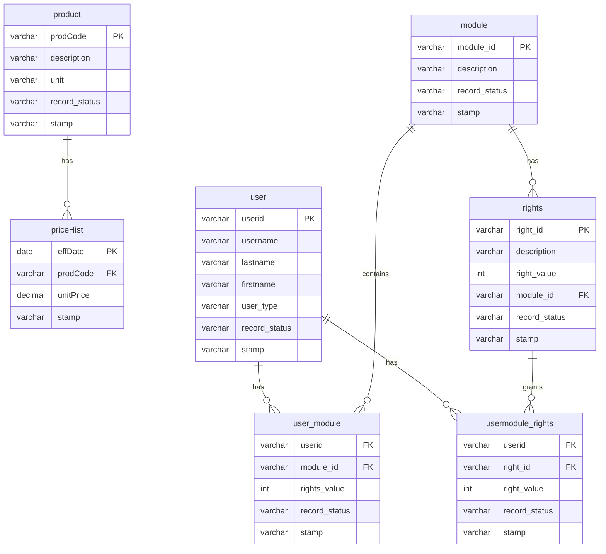

# Hope PMS Database ERD Notes

## Main Product Tables

### product
- `prodCode` — Primary Key
- `description` — Product name or description
- `unit` — Unit of measure
- `record_status` — ACTIVE or INACTIVE
- `stamp` — Audit trail

### priceHist
- `effDate` — Effective date of price change
- `prodCode` — Foreign Key connected to `product.prodCode`
- `unitPrice` — Product price
- `stamp` — Audit trail

### Relationship
- One `product` can have many `priceHist` records.
- `priceHist.prodCode` references `product.prodCode`.

---

## Rights Management Tables

### user
- `userid` — Primary Key
- `username`
- `lastname`
- `firstname`
- `user_type` — SUPERADMIN, ADMIN, or USER
- `record_status` — ACTIVE or INACTIVE
- `stamp` — Audit trail

### module
- `module_id` — Primary Key
- `description`
- `record_status`
- `stamp`

### user_module
- `userid` — Foreign Key connected to `user.userid`
- `module_id` — Foreign Key connected to `module.module_id`
- `rights_value` — 1 = allowed, 0 = not allowed
- `record_status`
- `stamp`
- Composite Primary Key: `userid` + `module_id`

### rights
- `right_id` — Primary Key
- `description`
- `right_value` — 1 = allowed, 0 = not allowed
- `module_id` — Foreign Key connected to `module.module_id`
- `record_status`
- `stamp`

### usermodule_rights
- `userid` — Foreign Key connected to `user.userid`
- `right_id` — Foreign Key connected to `rights.right_id`
- `right_value` — 1 = allowed, 0 = not allowed
- `record_status`
- `stamp`
- Composite Primary Key: `userid` + `right_id`

---

## Access Control Notes

- `SUPERADMIN` has full system access.
- `ADMIN` can manage products and reports, but cannot modify SUPERADMIN accounts.
- `USER` can add and edit products, but cannot soft-delete products or access admin functions.
- USER accounts can only see records where `record_status = 'ACTIVE'`.
- ADMIN and SUPERADMIN can see both ACTIVE and INACTIVE records.
- No hard delete is allowed.
- Product deletion must be done by updating `record_status` to `INACTIVE`.
- Product recovery must be done by updating `record_status` back to `ACTIVE`.
- Stamp columns are hidden from USER accounts.

---

## Mermaid ERD

---

## Sprint 1 M3 Notes

This file is for the Sprint 1 M3 Backend / Database Engineer deliverable:

- Database schema documented
- ERD notes committed
- Relationships explained
- Access control rules summarized
